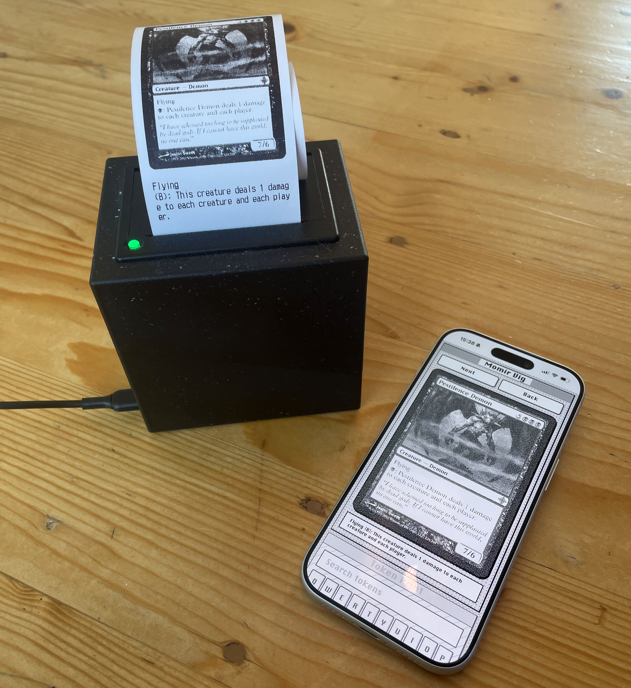

# Mo



Mo is a Raspberry Pi thermal printer solution for Magic: The Gathering.  
Get a random momir creature, print cards, decks, tokens, anything really! 
Runs fully offline.

This started as a Momir Basic printer, but right now it has functionality way beyond that.


## Features

- Momir Basic, pick a CMC and Mo will print instantly
- Mo-Jho-Sto support, complete with avatar images
- System 7 inspired web interface with numpad and token/card search windows
- Decklist window to print multiple cards at once, deck-preview window to review before print
- MTGTOP8 scraper to pull top 8 decks in various formats
- Completely offline at runtime — all images and databases are stored on the pi
- Dithered images optimised for thermal printing
- Switch for hotspot/network mode (handy when away from home)
- The scripts always try to pull the first printing of a card
- Webapp support for bookmarking without an adress bar on mobile devices
- Double-sided cards get printed as one continuous image

## How it works

The project has two distinct stages:

**Build (on your Mac/Pc)** — pull card data from Scryfall, dither images, build databases, test the app locally.  
**Runtime (on the Pi)** — serve the Flask app on boot, handle printer output.

## Project Structure

```
Mo/
├── app/                          # Everything that runs on the Pi
│   ├── app.py                    # Flask app entry point
│   ├── utils.py                  # Card loading/filtering
│   ├── helpers.py                # Shared helpers
│   ├── printer.py                # ESC/POS thermal printer driver
│   ├── netswitch.py              # GPIO switch reader — called by systemd at boot
│   ├── run.sh                    # Pi startup script
│   ├── data/                     # Built by pipeline (gitignored)
│   │   ├── card_text_index.json
│   │   └── token_data.json
│   ├── routes/                   # Flask route blueprints
│   ├── templates/index.html
│   └── static/                   # style.css (compiled from sass/), script.js
├── images/                       # Downloaded full-colour images (gitignored)
│   ├── creature/
│   ├── instant/
│   ├── artifact/
│   ├── token/
│   └── ...                       # One folder per card type, subfolder per CMC
├── images_dithered/              # Dithered BMPs deployed to Pi (gitignored)
│   ├── creature/
│   ├── token/
│   └── ...
├── js/                           # JS source modules (built to app/static/js/)
├── sass/                         # Sass source → app/static/css/style.css
├── cards_json/                   # MTGJSON source files (gitignored)
├── deck_lists/                   # Fetched decklists (gitignored)
├── scripts/
│   ├── build/                    # Mac/PC only — data pipeline
│   │   ├── pipeline.py           # Run all build steps
│   │   ├── extract_cards.py
│   │   ├── extract_creatures.py
│   │   ├── download_images.py
│   │   ├── download_tokens.py
│   │   ├── dither_for_printer.py
│   │   ├── dither_tokens.py
│   │   ├── dither_avatars.py
│   │   ├── dither_momir_avatar.py
│   │   ├── build_card_text_index.py
│   │   ├── refresh_token_metadata.py
│   │   ├── fetch_set_list.py
│   │   ├── fetch_top8_decklists.py
│   │   ├── add_cards.py
│   │   └── cleanup_images.py
│   └── deploy/                   # Pi setup and deployment
│       ├── deploy_pi.sh          # Mac → Pi rsync + service restart
│       ├── install_momir_service.sh  # Run once on Pi
│       └── switch_pi_network_mode.sh # Manual network mode switch
├── config.example.sh             # Copy to config.sh and fill in your values
├── docs/
│   ├── develop.md                # Local dev server, Sass, venv
│   ├── update.md                 # Adding cards, running the build pipeline
│   └── deploy.md                 # Pi setup, rsync, systemd, network modes
├── run.sh                        # Local dev start script
└── requirements.txt
```

## Docs

| Guide | Contents |
|---|---|
| [docs/setup.md](docs/setup.md) | First-time setup — environment, downloading data, building images |
| [docs/develop.md](docs/develop.md) | Local dev server, Sass, JS, API routes |
| [docs/update.md](docs/update.md) | Adding new sets, re-running parts of the pipeline |
| [docs/deploy.md](docs/deploy.md) | Pi setup, deploying updates, network modes |
| [docs/bom.md](docs/bom.md) | Bill of materials — hardware components |
| [docs/hardware.md](docs/hardware.md) | Wiring, power setup, GPIO pinout |

## Support

I've done my best to make forking this project as easy as possible — it takes some work but it's a lot of fun to get printing this way!

If you enjoy the project, consider buying me a coffee:  
[ko-fi.com/ojazeker](https://ko-fi.com/ojazeker)